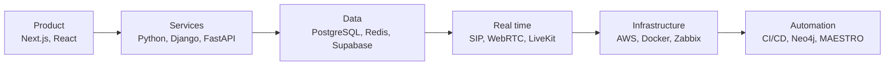
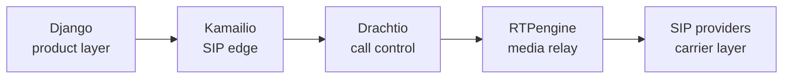

  

  

  <b>VOL. MMXXVI</b> &nbsp;·&nbsp; <i>One engineer, many domains</i> &nbsp;·&nbsp; <b>Printed in Islamabad</b>

 

  
  
  
  
  

 

---

## The Engineer Who Builds the Whole System

*Full-stack applications, real-time voice, VoIP infrastructure and the monitoring that keeps all of it honest.*

**Finance · SaaS · Telecom · Artificial Intelligence · Infrastructure · Automation**

---

### Local engineer, global systems

Haroon Saleem is a **full-stack software engineer based in Islamabad, Pakistan**, with three years of production work behind him. He builds software around the way businesses actually operate: full-stack products, backend APIs, AI systems, real-time communications, cloud infrastructure, monitoring and automation.

Recent projects cover mortgage lending, rental SaaS, IT infrastructure, developer automation, VoIP, call operations, CRM platforms and voice AI. Earlier engineering work adds computer vision, FPGA image processing, satellite communications and system administration to the record.

> **The domain changes from one project to the next. The method does not.**
> Learn the workflow, design the system, build the interfaces, connect the infrastructure, test the path, then ship and operate it.

It is an unglamorous sequence, and it is the reason the systems stay up long after the launch announcement has scrolled off the page.

- **Project Lead** at [CCRIPT Agency](https://develos.xyz) and Neuralogic, leading delivery across fintech, SaaS, monitoring and AI automation
- **MSc Electrical & Computer Engineering** at NUST (2024 to 2027); BSc from Capital University of Science & Technology
- Building a **personal VoIP platform** from product layer to carrier edge
- Heading toward delivery management and, in time, a CTO seat

### By the numbers

| **3+** | **19** | **6** | **70+** |
|:---:|:---:|:---:|:---:|
| Years in production | Systems on file | Credentials | Repositories |

*Nineteen of those systems are on file. Most of them are still running.*

### The system view

*How a build fits together, layer by layer.*

---

## Section B &nbsp;·&nbsp; The Work

*Nineteen systems, grouped by the desk they were built at. Everything here was built for production use, not for a portfolio page.*

<b>CCRIPT Agency, current desk</b> &nbsp;·&nbsp; <i>Product, SaaS, infrastructure, AI</i>

 

#### A lending platform, from application form to closing
Loan and mortgage platform work covering both loan origination and point-of-sale workflows: the borrower-facing application journey, the internal processing screens, the backend services underneath them, and the data model that has to satisfy both at once. Mortgage software lives or dies on the accuracy of its workflow, so the build started with how loan officers actually move a file forward, then worked outward into interfaces and infrastructure.

| At a glance | |
|---|---|
| **Domain** | Loan origination and mortgage operations |
| **Product** | LOS and POS workflows, business interfaces |
| **Platform** | Next.js, FastAPI, Django, PostgreSQL, Redis |
| **Delivery** | AWS, automated testing, CI/CD |

#### Rental trailer platform
A multi-tenant SaaS product for trailer rental operations. Each operator gets isolated data on shared infrastructure. *Next.js, Supabase, Vercel.*

#### Lead manager with an AI front door
Lead intake, qualification, follow-up sequencing and communication tracking for real estate teams, with automated handling of the repetitive first-touch work that agents usually lose to their inbox. *Python, Django, PostgreSQL.*

#### Zabbix and Meraki monitoring
Infrastructure monitoring and network operations: Zabbix templates and triggers, Cisco Meraki device telemetry, Python and Bash tooling, and dashboards for the people watching the estate. *Zabbix, Meraki, Python, Bash.*

#### An agentic development pipeline
A pipeline that carries development work through planning, implementation, verification and escalation without supervision, with a memory layer in Neo4j and CI/CD at the end of the line. *Python, Neo4j, MAESTRO.*

<b>VEEIVS, communications and CRM</b> &nbsp;·&nbsp; <i>Voice, telephony, CRM, AI</i>

 

#### Watching every call, while it is still happening
A telephony system for high-volume call operations, carrying live call state, logs, recordings, analytics and alerting. SIP and WebRTC connect through Twilio and Telnyx into backend call control, with async processing keeping the write path clear during peaks.

> The hard part is not the call. It is knowing, at any second, what every call is doing, and being able to prove it afterwards.

| At a glance | |
|---|---|
| **Call path** | WebRTC and SIP into carrier APIs, then backend control |
| **Operations** | Live state, logs, recordings, analytics |
| **Platform** | Python, Django, FastAPI, React |
| **Scale** | PostgreSQL, Redis, async processing |

#### Dialer system
Campaign-driven dialing tied into call state, routing rules, agent workflows and carrier integrations, so supervisors can change a campaign without touching the call path. *Django, React, Telnyx, Twilio.*

#### CRM platforms
Internal and customer-facing CRM covering users, campaigns, role-based permissions, interaction history and activity tracking across the operation. *Django, PostgreSQL, React.*

#### Soft switch development
SIP call control, routing, carrier connectivity and media handling. Real-time call processing built at the signalling layer rather than bolted on above it. *Kamailio, Drachtio, RTPengine.*

#### VICIdial operations
Working inside the wider call-center stack alongside the dialer, routing layer, CRM and carrier-connected operations that VICIdial and Asterisk sit within. *VICIdial, Asterisk, SIP.*

#### Voice-enabled assistant
Speech to text, language model orchestration and text to speech over live audio, with telephony control, interruption handling and live transcripts for the human listening in. *Deepgram, Vapi, ElevenLabs, LiveKit.*

#### Automated call QA
Call analysis producing summaries, disposition classification, sentiment and topic signals, and compliance validation. QA coverage across every call instead of a sampled few. *Python, Django, applied ML.*

<b>Personal build, in progress</b> &nbsp;·&nbsp; <i>Owning the stack from product layer to carrier edge</i>

 

#### Building the whole VoIP platform, alone
A personal platform for call tracking, monitoring, dialer operations, SIP provider connectivity, routing and soft-switch call handling. The architecture spans application services, SIP signalling, media, provider connectivity, databases and observability. Nothing here is outsourced to a vendor abstraction, which is exactly the point. Every layer is one that has to be understood before it can be operated.

*Fig. 1: Signalling and media path for the personal VoIP platform. Also on the desk: PostgreSQL, Redis and Zabbix.*

> *"Full control of the communications stack, from the product layer down to the carrier edge."*

<b>From the archives</b> &nbsp;·&nbsp; <i>Software, embedded, cloud, research</i>

 

- **Palm print recognition:** biometric authentication from document-scanner imagery. Second place at the 2024 final year project showcase. *Python, MATLAB, computer vision.*
- **Image processing on silicon:** sharpening and smoothing filters on a Spartan-3 FPGA. *Verilog, MATLAB, FPGA.*
- **Dockerized microservices:** Django and Node.js services on AWS with secure deployment, pipelines and service isolation. *Docker, AWS, GitHub Actions.*
- **Payments and subscriptions:** Stripe workflows with webhooks covering plan management, transactions, subscription state and reporting. *Stripe, webhooks, Django.*
- **Real-time sensor monitoring:** a sensor network with live dashboards, event alerting and cloud integration. *IoT, embedded, cloud.*
- **Early voice assistant work:** the first real-time speech work, wiring LiveKit, Vapi, Deepgram and ElevenLabs into backend services.

---

## Section C &nbsp;·&nbsp; The Record

*Roles, in reverse order.*

| Period | Desk | Role |
|---|---|---|
| **Apr 2026 to now** | **CCRIPT Agency** | Full-stack software engineer from April 2026, and Project Lead PL2 from May 2026. Leading delivery across finance, SaaS, infrastructure monitoring, agentic development tooling and full-stack product systems. |
| **Jan 2024 to Jan 2026** | **VEEIVS** | Progressed from Python engineer to backend developer, mid full-stack engineer and full-stack software engineer. Built backend, CRM, telephony, AI voice, cloud and real-time communication systems with Django, FastAPI, Twilio, Telnyx, LiveKit, PostgreSQL, Redis, AWS, SIP and WebRTC. |
| **Feb 2026 to Mar 2026** | **M/s Tecknotra** | Microwave engineering: satellite and microwave link engineering, hardware diagnostics and link-quality optimization. |
| **Apr 2023 to Nov 2023** | **Mars BPO** | Full-stack software engineer. Built speech-AI assistants, conversational voice workflows, a multi-campaign CRM, and Django APIs serving React, Vite and Expo frontends. |
| **Earlier** | **Foundations** | Satellite communications, Windows infrastructure, automation scripting, computer vision, FPGA image processing, and electrical and computer engineering. |

---

## Section D &nbsp;·&nbsp; The Toolbox

*Tools follow the problem, not the other way round.*

| | |
|---|---|
| **Languages** |        |
| **Product & interface** |       |
| **Services & APIs** |          |
| **Storage & state** |        |
| **Telephony & voice AI** |                   |
| **Cloud & delivery** |             |
| **Infrastructure & monitoring** |           |
| **AI & applied ML** |      |
| **Testing & hardware** |           |

**Learn the workflow first.** Finance, telecom, SaaS, AI or infrastructure: the build starts with how the business actually operates, not with the framework.

**Design across the boundaries.** Frontend, APIs, data, integrations, deployment and observability need one coherent design, or the seams show up in production.

**Build for the day after launch.** Testing, CI/CD, monitoring, reliability and operational ownership are part of the system, not a phase that comes later.

---

## Section E &nbsp;·&nbsp; Honours

*Certification and awarded work.*

| | Title | What it covers |
|:---:|---|---|
| ✦ | **Full Stack Developer 101** | End-to-end web application development, APIs, authentication and deployment |
| ✦ | **Python Django 101** | Django, REST APIs, authentication, ORM and production practice |
| ✦ | **Asterisk Certified Essentials** | PBX, IVR, SIP trunking, call routing and telephony operations |
| ✦ | **OpenSIPS Training 3.2** | SIP routing, load balancing, failover and real-time signalling operations |
| ✦ | **PBXact Certified Essentials** | IP PBX setup, call flows, endpoint management and day-to-day operations |
| ✦ | **Building AI Integrations with Model Context Protocol (MCP)** | Connecting AI models to external tools and data through MCP |
| ★ | **Palm print recognition** | Biometric authentication research. *Second place, Final Year Project Showcase 2024* |

---

## The Toolmaker

Django, React, Twilio, Zabbix or a language model. The tool gets chosen after the workflow is understood, never before. The boring parts get automated so the interesting parts can be built properly.

> *"Good software feels like magic."*

  

---

## Back Page &nbsp;·&nbsp; Classifieds

### Send the problem, not the job title.

Product work, real-time systems, telephony infrastructure, or the monitoring layer that ties them together. Describe the workflow you need built and the constraints around it, and you will get a straight answer about whether it is a good fit.

  
  
  
  

 

  <i>People build technology, technology builds opportunity.</i> 
  © 2026 Haroon Saleem, Islamabad

  

