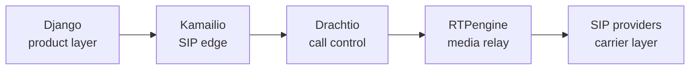

  

  

  
  
  
  
  

 

## About

I'm a **Full Stack Software Engineer** based in Islamabad, Pakistan. I build production software across **finance, SaaS, telecom, AI and infrastructure**: full-stack products, real-time voice systems, VoIP platforms, and the monitoring that keeps them honest.

My approach is the same whatever the domain: learn the workflow, design the system, build the interfaces, connect the infrastructure, test the path, then ship and operate it.

- **Project Lead** at [CCRIPT Agency](https://develos.xyz) and **Neuralogic**, leading delivery across fintech, SaaS, monitoring and AI automation
- **MSc Electrical & Computer Engineering** at NUST (2024 to 2027); BSc from Capital University of Science & Technology
- Building a **personal VoIP platform** from product layer to carrier edge (Kamailio, Drachtio, RTPengine)
- Shipping **voice AI** with Vapi, LiveKit, Deepgram and ElevenLabs
- Heading toward delivery management and, in time, a CTO seat

## What I Build

| Area | What it covers |
|---|---|
| **Full-stack products** | Next.js / React frontends on Django and FastAPI backends, with PostgreSQL, Redis and Supabase underneath |
| **Voice AI** | Real-time STT → LLM → TTS pipelines with interruption handling, live transcripts and webhook-driven call control |
| **VoIP & telephony** | SIP trunking, soft-switch call handling, dialers, IVR, routing, carrier integrations (Twilio, Telnyx) |
| **AI automation** | LLM-driven workflows, automated call QA, AI-assisted lead management, agentic development pipelines |
| **Cloud & DevOps** | Dockerized services on AWS (ECS, ECR, EC2, RDS, S3, Lambda), GitHub Actions CI/CD |
| **Infrastructure monitoring** | Zabbix and Cisco Meraki telemetry, triggers and dashboards |

## Selected Work

<b>Production systems</b>

- **Lending & mortgage platform**: loan origination and point-of-sale workflows, borrower-facing application journey, internal processing screens and backend services. *(Next.js, FastAPI, Django, PostgreSQL, Redis, AWS)*
- **Multi-tenant rental SaaS**: isolated customer data on shared infrastructure. *(Next.js, Supabase, Vercel)*
- **AI-assisted lead manager**: lead intake, qualification, follow-up sequencing and communication tracking. *(Python, Django, PostgreSQL)*
- **Live call operations platform**: live call state, logs, recordings, analytics and alerting over SIP/WebRTC with Twilio and Telnyx. *(Django, FastAPI, React, Redis)*
- **Multi-campaign CRM & dialer**: role-based permissions, campaign dialing, live call monitoring and activity tracking. *(Django, React, PostgreSQL)*
- **Automated call QA**: AI summaries, disposition classification, sentiment/topic analysis and compliance validation across recorded calls. *(Python, Django, applied ML)*
- **Zabbix + Meraki monitoring**: templates, triggers, device telemetry and dashboards. *(Zabbix, Meraki, Python, Bash)*
- **Agentic development pipeline**: planning, implementation, verification and escalation with a Neo4j memory layer. *(Python, Neo4j, MAESTRO)*

<b>Personal build: VoIP platform (in progress)</b>

A VoIP platform covering call tracking, monitoring, dialer operations, SIP provider connectivity, routing and soft-switch call handling.

*Also: PostgreSQL, Redis and Zabbix for data and observability.*

<b>Earlier engineering & research</b>

- **Enhanced Palm Print Recognition**: biometric authentication from document-scanner imagery (Python, MATLAB, computer vision). *2nd place, 2024 final year project showcase*
- **FPGA image processing**: sharpening and smoothing filters on a Spartan-3 (Verilog, MATLAB)
- **Dockerized microservices**: Django and Node.js services on AWS with GitHub Actions pipelines
- **Payments & subscriptions**: Stripe workflows with webhooks, plan management and reporting
- **Real-time IoT monitoring**: sensor network with live dashboards, alerts and cloud integration

## Tech Stack

| | |
|---|---|
| **Languages** |        |
| **Backend & APIs** |         |
| **Frontend** |      |
| **AI & Voice AI** |             |
| **VoIP & Real-Time** |               |
| **Databases** |        |
| **Cloud & DevOps** |            |
| **Monitoring & Infrastructure** |        |
| **Testing & Tools** |      |
| **Hardware & Embedded** |      |

## Certifications & Honours

- Asterisk Certified Essentials
- OpenSIPS Training 3.2
- PBXact Certified Essentials
- Building AI Integrations with Model Context Protocol (MCP)
- Full Stack Developer 101
- Python Django 101
- 2nd Place, Final Year Project Showcase 2024

## GitHub Activity

  

## Let's Talk

Got a workflow that needs building? Product work, real-time systems, telephony infrastructure or the monitoring layer that ties them together: send the problem, not the job title.

  
  
  
  

  

